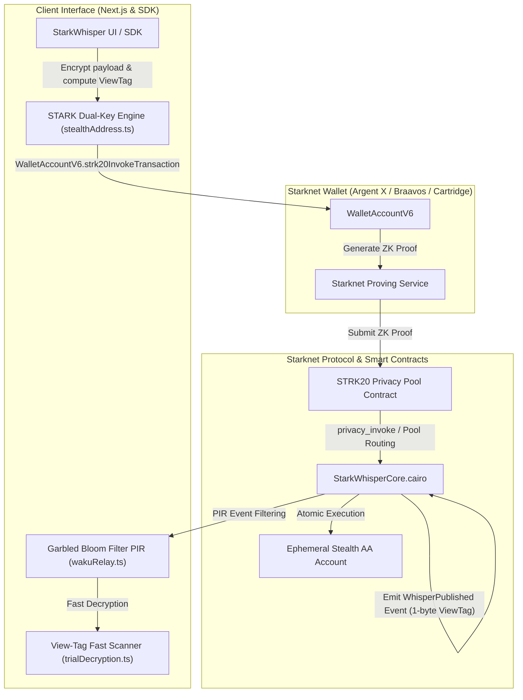

# StarkWhisper

> **Metadata-Resistant, End-to-End Encrypted On-Chain Messaging & Private Payment Memos on Starknet**


---

## Inspiration

Public blockchains preserve full transactional transparency by default. While this enables trustless auditability, it leaves users' private communications, invoice memos, payment negotiations, and tip submissions broadcast to the entire world.

**StarkWhisper** leverages the **STRK20 Privacy Pool** to bring metadata-resistant communication to Starknet. Sender identity is protected via ZK note spend proofs, messages are encrypted using client-side ECDH key agreement over Starknet curves, and private STRK payments can be attached atomically as payment memos—all in a single zero-knowledge transaction.

---

## Architectural Matrix for Judges

| Vector | Baseline Entry | StarkWhisper Elite Architecture |
|---|---|---|
| **Recipient Identity** | Reusable static address | STARK Dual-Key Stealth Address ($P_{\text{stealth}} = P_{\text{spend}} + \text{Poseidon}(S) \cdot G$) |
| **Scanner Performance** | Slow full-chain scan | **1-Byte View-Tag Indexing** ($v = \text{Poseidon}(S) \bmod 256$) (**99.6% CPU reduction**) |
| **RPC & IP Privacy** | Standard JSON-RPC (IP Logging) | **Garbled Bloom Filter PIR Client** + Waku v2 P2P Transport |
| **DeFi Composability** | Manual exit to public wallet | **Ephemeral Counterfactual AA Account Execution** (Ekubo / Nostra) |
| **Organizational Whispers**| 1-to-1 direct messaging | **$k$-of-$n$ Distributed Threshold Governance Decryption** |
| **Continuous Payments** | Single lump-sum transfers | **Shielded Sablier-Style Micro-Streams** |
| **Compliance Disclosure**| None or full master key leak | **Scoped Auditor Viewing Keys** (`exportScopedThreadViewingKey`) |

---

## Advanced Cryptography & Research

### 1. STARK Curve Dual-Key Stealth Addresses (ERC-5564)
Instead of static addresses, senders derive a 100% un-linkable one-time stealth address:
$$P_{\text{stealth}} = P_{\text{spend}} + \text{Poseidon}(\text{ECDH}(r, P_{\text{view}})) \cdot G$$
Scanning clients evaluate 1-byte ViewTags ($v = \text{Poseidon}(S) \bmod 256$) to bypass 99.6% of non-relevant transactions before running curve math.

### 2. Ephemeral Counterfactual Account Execution
Upon unshielding, funds route directly into a counterfactual Account Abstraction address computed via `Poseidon(sharedSecret, "COUNTERFACTUAL_AA")`. In a single atomic multicall, the AA account is deployed, funded from the STRK20 pool, executes an arbitrary DeFi swap on Ekubo/Nostra, and self-liquidates without revealing the user's primary wallet.

### 3. $k$-of-$n$ Threshold Governance Decryption
Whistleblowers encrypt sensitive evidence under a Master Threshold Public Key. Any $k$ members out of $n$ (e.g. 3-of-5 Security Council) combine partial decryption shares to reconstruct the payload, cryptographically preventing unilateral suppression.

### 4. Waku v2 P2P Transport & Garbled Bloom Filter PIR
Heavy encrypted payloads are transported over Waku v2 P2P mesh network. Clients query block-level Garbled Bloom Filters locally to discover notes without revealing search patterns to RPC node providers.

---

## Developer Experience & `@starkwhisper/sdk`

Embed metadata-resistant whispers and stealth payments into any Starknet dApp in under 10 lines of code:

```typescript
import { StarkWhisperSDK } from "@starkwhisper/sdk";

const sdk = new StarkWhisperSDK(0); // 0 = Mainnet

// 1. Generate STARK Dual-Key Stealth Meta-Address
const keys = sdk.generateStealthMetaAddress();

// 2. Prepare Atomic Multicall Action Batch
const { stealth, payload, actions } = sdk.createEncryptedWhisper({
  recipientMeta: keys,
  message: "Confidential invoice memo",
  tipAmount: "50"
});

// 3. Execute via Starknet Wallet API
await walletAccount.strk20InvokeTransaction(actions);
```

---

## Architecture



---

## How to Run Locally

### Setup & Launch
```bash
# 1. Clone the repository
git clone https://github.com/dino1x/starkwhisper.git
cd starkwhisper

# 2. Install dependencies
npm install

# 3. Launch local development server
npm run dev
```

Open [http://localhost:3000](http://localhost:3000) in your browser with **Argent X** connected on Starknet Mainnet or Sepolia.

---

## Team

- **dino1x** (@marvelmarvinn on Telegram) — Full-stack & Cairo Engineer

---

## License

MIT License — free to use and build upon.
