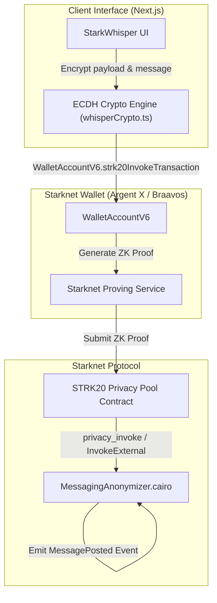

# StarkWhisper

> **Metadata-Resistant, End-to-End Encrypted On-Chain Messaging & Private Payment Memos on Starknet**


---

## Inspiration

Public blockchains preserve full transactional transparency by default. While this enables trustless auditability, it leaves users' private communications, invoice memos, payment negotiations, and tip submissions broadcast to the entire world.

**StarkWhisper** leverages the **STRK20 Privacy Pool** to bring metadata-resistant communication to Starknet. Sender identity is protected via ZK nullifiers (`InvokeExternal`), messages are encrypted using client-side ECDH key agreement, and private STRK payments can be attached atomically as payment memos—all in a single zero-knowledge transaction.

---

## What It Does

- **End-to-End Encrypted Messaging:** Direct private messaging between any two Starknet privacy pool users.
- **Private Payment Memos:** Attach a shielded STRK transfer to an encrypted message. The payment note spend and message posting occur atomically in one ZK proof.
- **Metadata Resistance:** Nobody watching the chain can tell who sent the message, who received it, or what amount was transferred.
- **Starknet Wallet API Integration:** Zero client-side crypto setup for the user— Argent X handles keys and ZK proof generation seamlessly.
- **STRK20 Design System:** Built with native STRK20 brand guidelines.

---

## Architecture



---

## How We Built It

- **Smart Contracts (Cairo 2024_07):** Custom `MessagingAnonymizer` helper contract (`cairo/src/lib.cairo`) implementing `IMessagingAnonymizer` and atomic `privacy_invoke_with_memo`.
- **Frontend Stack:** Next.js (App Router), TypeScript, custom CSS custom properties (STRK20 brand design system).
- **Wallet & Privacy Integration:** `starknet.js` v10.4.0 (`WalletAccountV6`), `@starknet-io/get-starknet-wallet-standard`, `starknet` Poseidon/Pedersen hashes.
- **Crypto Engine:** Client-side felt-packing string encoder and ECDH shared key derivation (`src/utils/whisperCrypto.ts`).

---

## How to Run Locally

### Prerequisites
- Node.js >= 18
- Scarb (optional, for Cairo compilation)

### Setup & Launch
```bash
# 1. Clone the repository
git clone https://github.com/dino1x/starkwhisper.git
cd starkwhisper

# 2. Install dependencies
npm install

# 3. Launch local development server
npm run dev
```

Open [http://localhost:3000](http://localhost:3000) in your browser with **Argent X** connected on Starknet Mainnet or Sepolia.

---

## Accomplishments We're Proud Of

- Successfully combined private STRK token transfers and encrypted message storage into a **single atomic zero-knowledge transaction**.
- Built a zero-lag client-side felt encryption stream cipher that packs UTF-8 messages directly into Cairo felts.
- Fully compliant with the official **STRK20 Private Messaging RFP specification**.

---

## Team

- **dino1x** (@marvelmarvinn on Telegram) — Full-stack & Cairo Engineer

---

## License

MIT License — free to use and build upon.
