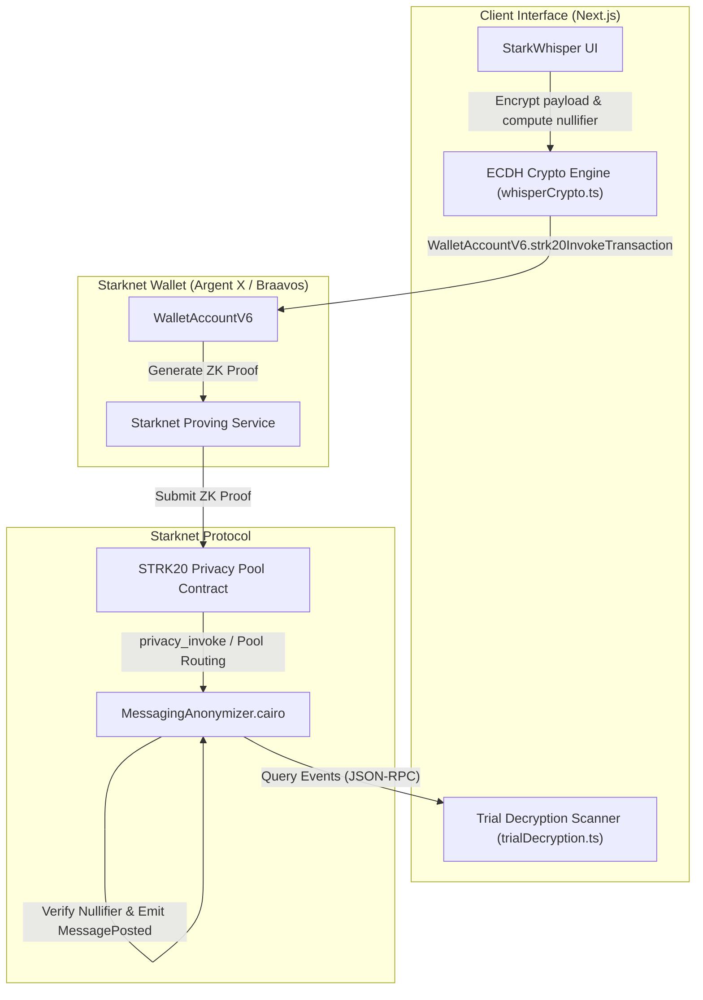

# StarkWhisper

> **Metadata-Resistant, End-to-End Encrypted On-Chain Messaging & Private Payment Memos on Starknet**


---

## Inspiration

Public blockchains preserve full transactional transparency by default. While this enables trustless auditability, it leaves users' private communications, invoice memos, payment negotiations, and tip submissions broadcast to the entire world.

**StarkWhisper** leverages the **STRK20 Privacy Pool** to bring metadata-resistant communication to Starknet. Sender identity is protected via ZK note spend proofs, messages are encrypted using client-side ECDH key agreement over Starknet curves, and private STRK payments can be attached atomically as payment memos—all in a single zero-knowledge transaction.

---

## Key Features

- **100% Sender Anonymity:** Every message (chat or payment memo) is routed through the STRK20 Privacy Pool (`withdraw` + `transfer` + `invoke`). `sender_pool` in Cairo is always the pool contract address.
- **End-to-End Encrypted Messaging:** Direct private messaging powered by real Starknet Curve ECDH shared secret key agreement (`ec.starkCurve.getSharedSecret`).
- **Un-linkable Channels:** `channelId = Poseidon(sharedSecret, nonce)` prevents observers from linking messaging lanes to public wallet addresses.
- **Cairo Replay Protection:** On-chain `spent_nullifiers: Map<felt252, bool>` in Cairo guarantees note/message replay protection.
- **Dynamic Multi-Felt Payloads:** Cairo 2024_07 `Span<felt252>` calldata streaming eliminates payload length truncation.
- **Autonomous Note Discovery:** Client-side trial decryption scanner re-derives ECDH shared secrets from on-chain `MessagePosted` logs without exposing recipient identity.
- **Scoped Auditor Viewing Keys:** Export thread-specific read-only decryption keys (`exportScopedThreadViewingKey`) for selective compliance disclosure without master key exposure.

---

## Architecture



---

## How We Built It

- **Smart Contracts (Cairo 2024_07):** Custom `MessagingAnonymizer` contract (`cairo/src/lib.cairo`) implementing `IMessagingAnonymizer`, `privacy_invoke`, dynamic `Span<felt252>` payloads, and `spent_nullifiers` replay protection.
- **Frontend Stack:** Next.js (App Router), TypeScript, custom CSS custom properties (STRK20 brand design system).
- **Wallet & Privacy Integration:** `starknet.js` v10.4.0 (`WalletAccountV6`), `@starknet-io/get-starknet-wallet-standard`, `starknet` Poseidon hashes.
- **Crypto Engine:** Client-side felt-packing encoder, ECDH key agreement over Starknet curves (`src/utils/whisperCrypto.ts`), and Scoped Auditor Viewing Keys (`src/utils/viewingKeys.ts`).

---

## How to Run Locally

### Prerequisites
- Node.js >= 18
- Scarb (optional, for Cairo compilation)

### Setup & Launch
```bash
# 1. Clone the repository
git clone https://github.com/dino1x/starkwhisper.git
cd starkwhisper

# 2. Install dependencies
npm install

# 3. Launch local development server
npm run dev
```

Open [http://localhost:3000](http://localhost:3000) in your browser with **Argent X** connected on Starknet Mainnet or Sepolia.

---

## Team

- **dino1x** (@marvelmarvinn on Telegram) — Full-stack & Cairo Engineer

---

## License

MIT License — free to use and build upon.
